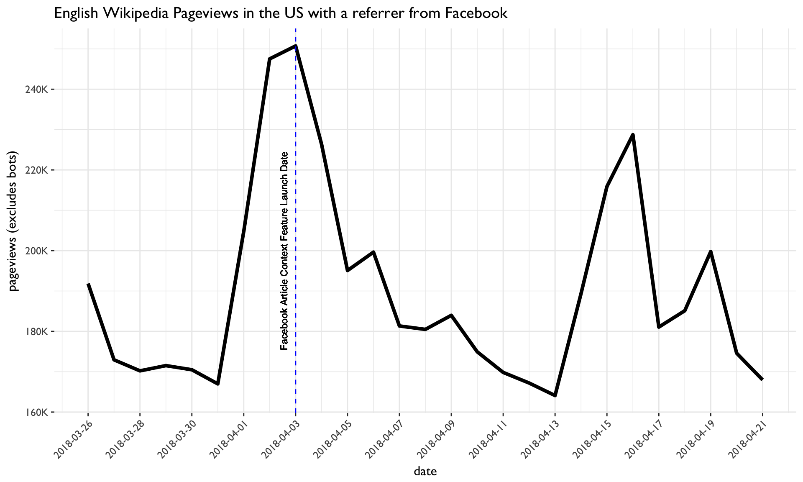

# Estimate the impact of Facebook's article context feature on English Wikipedia Pageviews
Ticket: [T191429](https://phabricator.wikimedia.org/T191429)

## Overview

Facebook completed a full rollout of their article context feature on April 3, 2018, which allows users to view context about an article including the publisher’s Wikipedia entry. This feature was available to all of its users in the United States.

We're interested in evaluating the impact of this changes on English Wikipedia Pagveiews. To investigate, we will:

1. Calculate the daily number of enwiki pageviews in the US with a referrer from Facebook, before and after the begin of the feature's full rollout on April 3, 2018
2. Estimate the number of additional daily pageviews resulting from the feature
3. Publish a list of the top N pages receiving the most referrers, for some timespans before and after the rollout

## Daily English Wikipedia Pageview with a referrer from Facebook

There does not appear to be any significant changes in daily pageviews to English Wikipedia from Facebook immediately following the full rollout of the article context feature on April 3, 2018. There's an increase in all pageviews with a facebook referrer prior to the rollout between March 31 and April 2nd. This may be due to higher facebook traffic over the Easter holiday weekend. Further review of pageviews over the coming weeks will help determine if there are any sustained overall increases in daily pageviews with a facebook referrer.

Note the data collected currently includes all English Wikipedia pageviews with a Facebook referrer; not just users directed to English Wikipedia from the article context feature. 

A breakdown by access method shows a slight increase in English Wikipedia pageviews on desktop following the release date while mobile desktop views decline. Most users accessing Wikipedia through Facebook were using mobile web, which makes sense given the higher usage of Facebook on mobile devices.

Pending a complete list of articles where this features is deployed, I reviewed a breakdown of pageviews for some popular US new sources that were confirmed to have the facebook article context feature. There is sharp increase of pageviews to these pages from Facebook on April 4th followed by a steady decline. 

## Top Facebook referred pages on English Wikipedia

I also review the top facebook referred pages before and after the rollout date. While there is a small increase in pageviews to the news media articles, the top facebook referred pages on English Wikipedia following the article context feature do not appear to be dominated by new media articles.

One week prior to the feature rollout date on April 3rd (March 26th through April 2nd), there are no news media related pages that occur in the top 50 viewed English Wikipedia pages with a facebook referrer.  Following the rollout, there are 5 news media articles with a facebook referrer that appear in the top 30 viewed pages one day after the rollout.  Between April 3rd through April 9th, this number declines to only 2 news media articles that appear in the top 30. 

#### Top Facebook referred new media pages on April 4th (day after rollout)

| Rank #  | Page Title | Requests |
| ------- |:----------:| -----:|
|13.| "The Daily Wire"(Mobile Web) | 718 |
|14. |"Breitbart News"(Desktop) | 679 |
|22. |"Vox (website)"(Mobile Web)| 466 |
|23. |"Breitbart News"(Mobile Web) | 462 |
|29. |"The Washington Post" (Mobile Web)| 425|

#### Top Facebook referred new media pages between April 3rd to April 9th

| Rank #  | Page Title | Requests |
| ------- |:----------:| -----:|
|16.| "The Daily Wire"(Mobile Web) | 2556 |
|28. |"Breitbart News"(Mobile Web) | 2021 |
|41. |"Breitbart News"(Desktop) | 1457 |
|42. |"The Daily Wire"(Desktop)| 1453 |
|45. |"Fox News"(Mobile Web)| 1350 |
|49. |"The Washington Post" (Mobile Web)| 1261|

