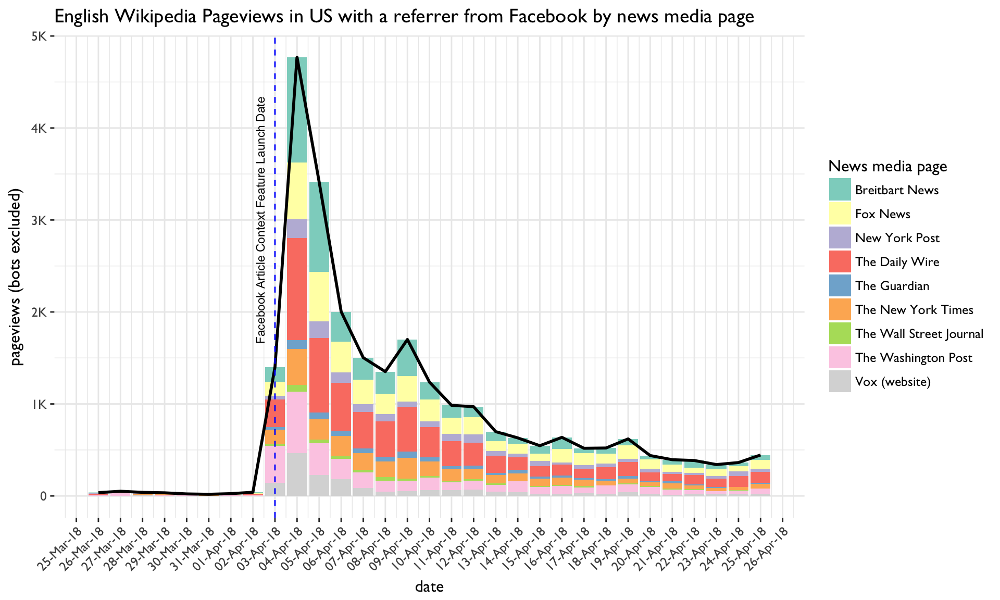

# Estimate the impact of Facebook's article context feature on English Wikipedia Pageviews
Ticket: [T191429](https://phabricator.wikimedia.org/T191429)

## Overview

Facebook completed a full rollout of their article context feature on April 3, 2018, which allows users to view context about an article including the publisher’s Wikipedia entry. This feature was available to all of its users in the United States.

We're interested in evaluating the impact of this changes on English Wikipedia Pagveiews. To investigate, we will:

1. Calculate the daily number of enwiki pageviews in the US with a referrer from Facebook, before and after the begin of the feature's full rollout on April 3, 2018
2. Estimate the number of additional daily pageviews resulting from the feature
3. Publish a list of the top N pages receiving the most referrers, for some timespans before and after the rollout

## Daily English Wikipedia Pageviews with a referrer from Facebook

 There do not appear to be any signficant changes following the full rollout of the article context feature on April 3, 2018. In addition, any potential effects from Facebook's article context feature appear to be too small to determine from the overall number of Facebook referrals.
 
The increase in daily Facebook referred pageviews prior to the rollout between March 31 and April 2nd is likely due to a higher facebook traffic over the Easter holiday weekend. Daily pageviews then continue to decline between April 9th through April 13th prior to another weekend increase. 

A breakdown by access method shows a slight increase in Facebook referred English Wikipedia pageviews on desktop following the release date while mobile desktop views decline. Most users accessing Wikipedia through Facebook were using mobile web.

## Top Facebook referred pages on English Wikipedia

We also reviewed the top facebook referred pages before and after the rollout date. While there is a small increase in pageviews to news media articles, the top facebook referred pages on English Wikipedia following the article context feature are not dominated by news media articles.

One week prior to the feature rollout date on April 3rd (March 26th through April 2nd), there are no news media related pages that occur in the top 50 viewed English Wikipedia pages with a facebook referrer.  Following the rollout, there are 5 news media articles with a facebook referrer that appear in the top 30 viewed pages one day after the rollout.  Between April 3rd through April 9th, this number declines to only 2 news media articles that appear in the top 30. 

#### Top Facebook referred new media articles on April 4th (day after rollout)

| Rank #| Page Title|Requests|
| ------- |:----------:| -----:|
|13.| "The Daily Wire"(Mobile Web) | 718 |
|14. |"Breitbart News"(Desktop) | 679 |
|22. |"Vox (website)"(Mobile Web)| 466 |
|23. |"Breitbart News"(Mobile Web) | 462 |
|29. |"The Washington Post" (Mobile Web)| 425|

#### Top Facebook referred new media articles between April 3rd to April 9th (week after rollout)

| Rank #  | Page Title | Requests |
| ------- |:----------:| -----:|
|16.| "The Daily Wire"(Mobile Web) | 2556 |
|28. |"Breitbart News"(Mobile Web) | 2021 |
|41. |"Breitbart News"(Desktop) | 1457 |
|42. |"The Daily Wire"(Desktop)| 1453 |
|45. |"Fox News"(Mobile Web)| 1350 |
|49. |"The Washington Post" (Mobile Web)| 1261|

## Daily English Wikipedia Pageviews to News-media related pages with a referrer from Facebook

To help isolate any potential effects from the article context features, we reviewed daily pageviews to a selection of 9 news-media related articles.

Pending a complete list of articles where this features is deployed, we selected pageviews to some popular news media pages on English Wikipedia including news media articles found in the top facebook referred pageviews following April 4th. 

A week prior to the feature rollout (March 26 - April 3rd), there were an average of 3 daily views to these pages with a Facebook refererer. There is a signficant increase of daily views to these pages from Facebook on April 4th; however, daily pageviews quickly decline after April 4th to an average of aound 40 pageviews to these pages between April 11 and April 18th. Some of the higher pageviews around April 4th seen for Brietbart and potentially other sources may be the result of Facebook posts linking to the article directly in the context of news related coverage released that day.  

